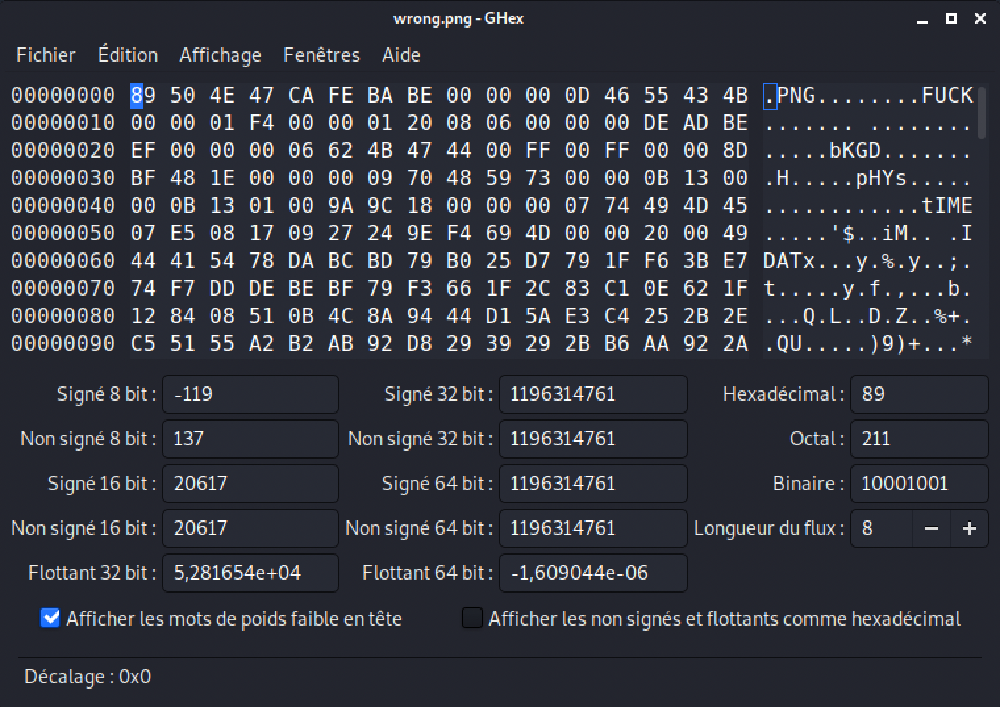
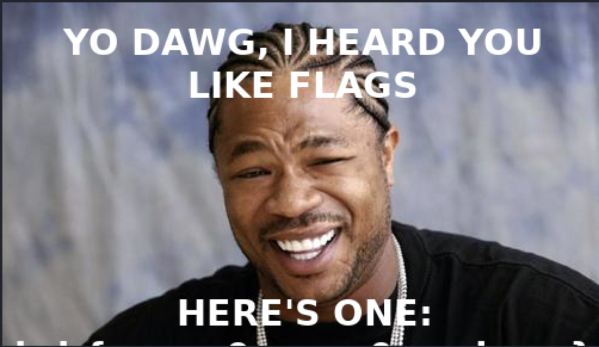
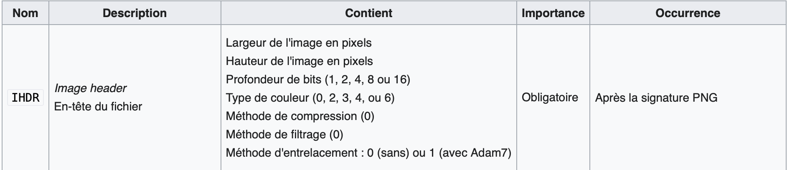

# Dawng Challenge

At the beginning of this challenge, we have to download what seems to be a PNG file, named "wrong.png".

To verify if it is true, we are going to check this information with the followed command-line :

```shell
file wrong.png
	wrong.png: data
```

So, we can see here that is not a real PNG file. Most of the time, as the file is corrupted, you will obtain this answer.

The next step will be to open the file with an hexadecimal editor (here I will use "ghex"), in order to search for some hints that gives information on this type of file.

So, I write :

```shell
ghex wrong.png
```


In this result, we can see a lot of bytes with their translations on the right. First idea, we are going to verify the file format (here PNG) by checking the header. The normal header for a PNG file is: `89 50 4E 47 0D 0A 1A 0A`. But here, we have: `89 50 4E 47 CA FE BA BE`. The last 4-bytes seem to be a troll "Cafe Babe". By remplacing them, we obtain the good PNG header.

After that, thanks to previously researchs on PNG file chunks (<a>https://en.wikipedia.org/wiki/Portable_Network_Graphics</a>), there is the IHDR chunk to correct. Here, one more time, we found a troll string "FUCK" traduced in hexadecimal by: `00 00 00 0D 46 55 43 CB`.

We replace this 8-bytes by: `00 00 00 0D 49 48 44 52` in order to make appear the "IHDR flag".


At the level, we have transformed our file in PNG format but it is still corrupted. We can see this corruption by executing:

```shell
exiftool wrong.png
ExifTool Version Number         : 12.16
File Name                       : wrong.png
Directory                       : .
File Size                       : 171 KiB
File Modification Date/Time     : 2021:08:29 10:10:37-04:00
File Access Date/Time           : 2021:08:29 10:10:37-04:00
File Inode Change Date/Time     : 2021:08:29 10:10:37-04:00
File Permissions                : rw-rw-r--
File Type                       : PNG
File Type Extension             : png
MIME Type                       : image/png
Warning                         : Corrupted PNG image
```

Our file is corrupted so we are going to check its integrity by executing:
```shell
pngcheck -v wrong.png
File: wrong.png (175316 bytes)
  chunk IHDR at offset 0x0000c, length 13
    500 x 288 image, 32-bit RGB+alpha, non-interlaced
  CRC error in chunk IHDR (computed 427981b3, expected deadbeef)
ERRORS DETECTED in wrong.png
```

Here, there are two information to remember. The IHDR length is 13-bytes long and there is an error on the computed CRC. So, by counting 13-bytes after IHDR flag, we arrive to the CRC (4-bytes long) which is actually: `DE AD BE EF'.

We replace it by the value given by the previous command: `42 79 81 B3`.

We re-execute the integrity check:
```shell
pngcheck -v wrong.png
File: wrong.png (175316 bytes)
  chunk IHDR at offset 0x0000c, length 13
    500 x 288 image, 32-bit RGB+alpha, non-interlaced
  chunk bKGD at offset 0x00025, length 6
    red = 0x00ff, green = 0x00ff, blue = 0x0000
  chunk pHYs at offset 0x00037, length 9: 2835x2835 pixels/meter (72 dpi)
  chunk tIME at offset 0x0004c, length 7: 23 Aug 2021 09:39:36 UTC
  chunk IDAT at offset 0x0005f, length 8192
    zlib: deflated, 32K window, maximum compression
  chunk IDAT at offset 0x0206b, length 8192
  chunk IDAT at offset 0x04077, length 8192
  chunk IDAT at offset 0x06083, length 8192
  chunk IDAT at offset 0x0808f, length 8192
  chunk IDAT at offset 0x0a09b, length 8192
  chunk IDAT at offset 0x0c0a7, length 8192
  chunk IDAT at offset 0x0e0b3, length 8192
  chunk IDAT at offset 0x100bf, length 8192
  chunk IDAT at offset 0x120cb, length 8192
  chunk IDAT at offset 0x140d7, length 8192
  chunk IDAT at offset 0x160e3, length 8192
  chunk IDAT at offset 0x180ef, length 8192
  chunk IDAT at offset 0x1a0fb, length 8192
  chunk IDAT at offset 0x1c107, length 8192
  chunk IDAT at offset 0x1e113, length 8192
  chunk IDAT at offset 0x2011f, length 8192
  chunk IDAT at offset 0x2212b, length 8192
  chunk IDAT at offset 0x24137, length 8192
  chunk IDAT at offset 0x26143, length 8192
  chunk IDAT at offset 0x2814f, length 8192
  chunk IDAT at offset 0x2a15b, length 2917
  chunk IEND at offset 0x2accc, length 0
No errors detected in wrong.png (27 chunks, 69.6% compression).
```

All is now good, the file is not anymore corrupted. And also, now, we can open our file.



On this PNG file, we can see that it is cut and it seems that the flag is just below the cut take place. So we have to resize our image but it is not possible to do this manually. We have to use one more time the hexadecimal code of the file.


Thanks to the research on the PNG file format, we have found that the IHDR chunk has a 13-bytes length.



The byte that we have to modify is the second (the height). Here, we have a height of `288` which is equal to `0x120. We will put a height of `400`, so in hexadecimal `0x190`.

We check the integrity another time:
```shell
pngcheck -v wrong.png
File: wrong.png (175316 bytes)                                                                                                                                                                                             
  chunk IHDR at offset 0x0000c, length 13                                                                                                                                                                                  
    500 x 400 image, 32-bit RGB+alpha, non-interlaced                                                                                                                                                                      
  CRC error in chunk IHDR (computed 58b392c6, expected 427981b3)                                                                                                                                                           
ERRORS DETECTED in wrong.png
```
We can that the height of the file has changed from `288` to `400`, but the CRC has changed. We replace it as previously, we do another check and the flag appears by opening the file !


