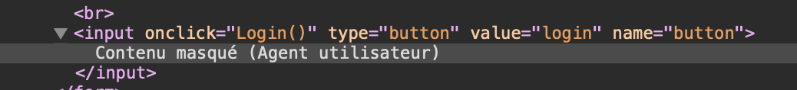
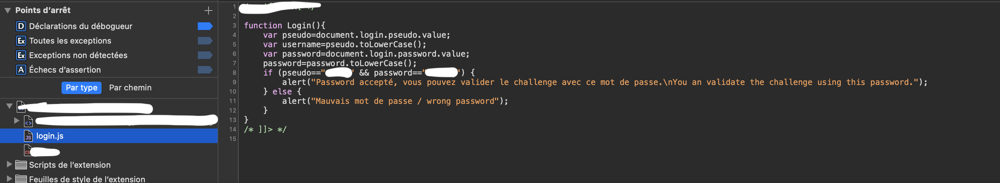
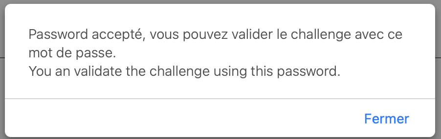

# Javascript - Authentication

At the beginning of this challenge, we are on a webpage with a simple form.

With the title of the challenge, we already have an idea on which we are going to focus on.

First step, we are going to look at the code and we are going to focus on the "Login" button.

We can observe that the login button called a function named "Login()". And when we naviguate into the resources of the webpage, we can see a javascript file with the login function. And clearly we have the good username to enter and the good password that we can use to validate the challenge.

