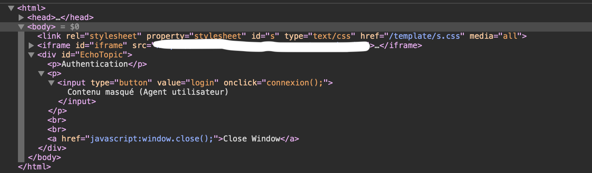
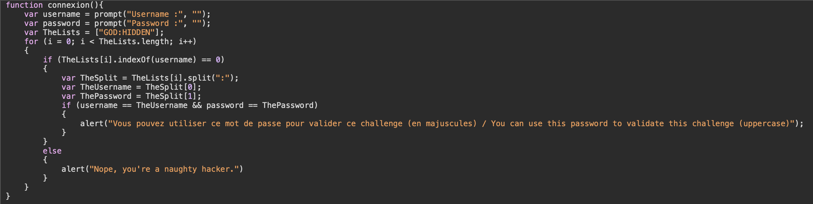

# Javascript - Authentication (2)

At the beginning of this challenge, we are on a webpage with a button "Login".
If we click on this, there is a pop-up asking for a username and a password.

With the title of the challenge, we already have an idea on which we are going to focus on.

First step, we are going to look at the code and we are going to focus on the "Login" button.

We can observe that the login button called a function named "connexion()". And when we naviguate into the resources of the webpage, we can see a javascript file with the login function. We can see that the username and password are given on a list "USERNAME:PASSWORD". There is so much code for nothing difficult.

