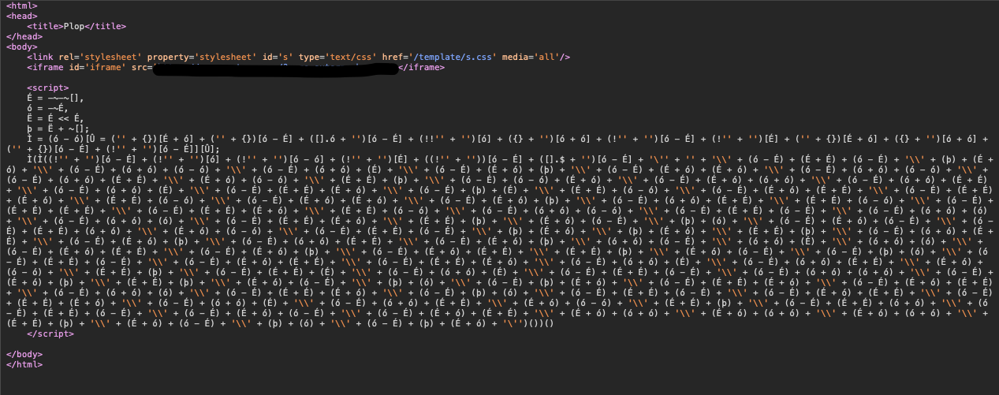
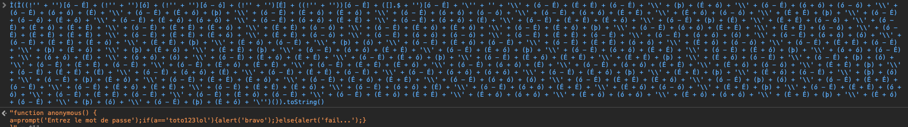

# Javascript - Native Code

At the beginning of this challenge, we are on a webpage with a pop-up asking for a password.
We enter something wrong and we are redirected on a web page without anything.

First step, we are going to look at the code and we can see a javascript function in the header of the webpage.

We can see that there is a big string, so first reflex, pass it in the console to translate it. When we enter the whole thing, we can see that the function execute. We have to replace the last two parenthesis at the end of the string by the `toString` function and it gaves us the password.

