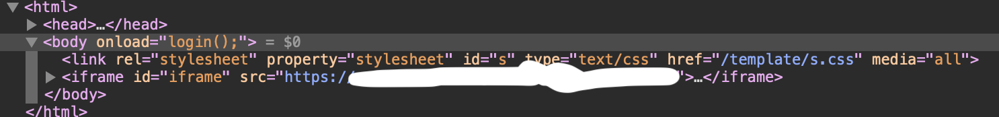
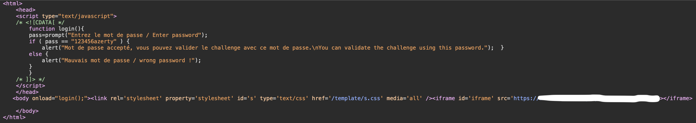

# Javascript - Source

At the beginning of this challenge, we are on a webpage with a pop-up asking for a password.

We can enter something and of course, this will be false.

First step, we are going to look at the code and we are going to focus on the "Login" function that is called in the body.

So, we go in the sources file of the webpage, we click on the login function. And we have the password to enter. We reload the webpage, enter the password and it is good.

