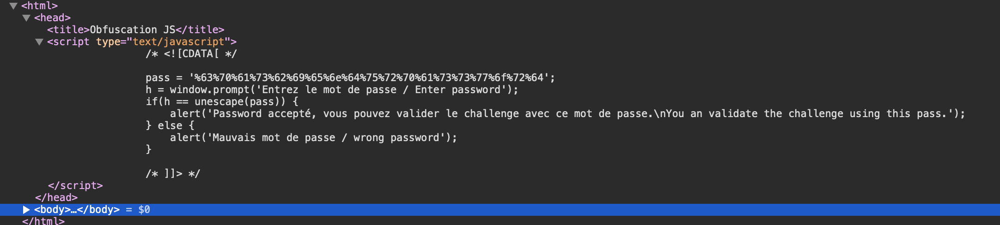
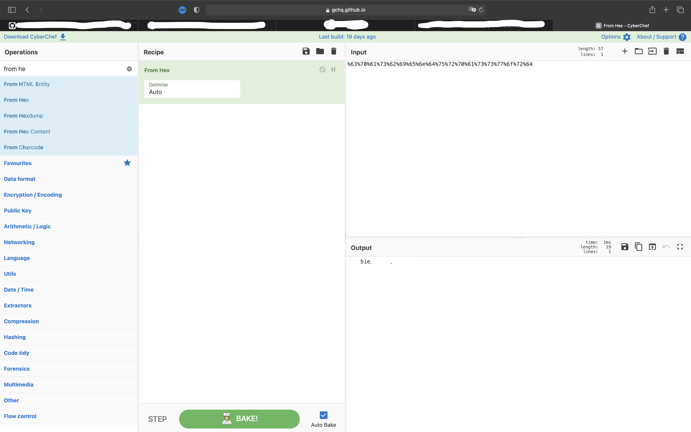

# Javascript - Obfuscation JS

At the beginning of this challenge, we are on a webpage with a pop-up asking for a password.
We enter something wrong and we are redirected on a web page without anything.

First step, we are going to look at the code and we can see a javascript function in the header of the webpage.

We can see the password encrypted in hexadecimal. Thank to a software, we can decrypt it and reload the webpage to enter the password and that's it.

