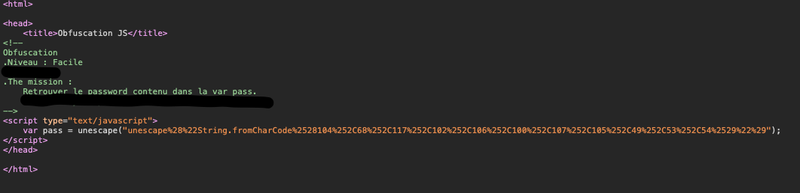
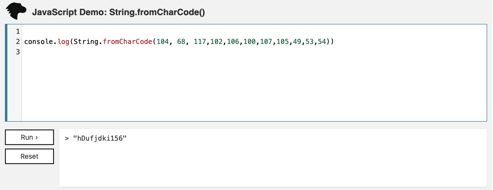

# Javascript - Obfuscation JS 2

At the beginning of this challenge, we are on a webpage with nothing.

First step, we are going to look at the code and we can see a javascript function in the header of the webpage.

We can see the password encrypted in hexadecimal in a variable neamed pass. We have to set up what it is written in the `String.fromCharCode()` function. Thank to a software or online with a JS console, we can decrypt it and reload the webpage to enter the password and that's it.

