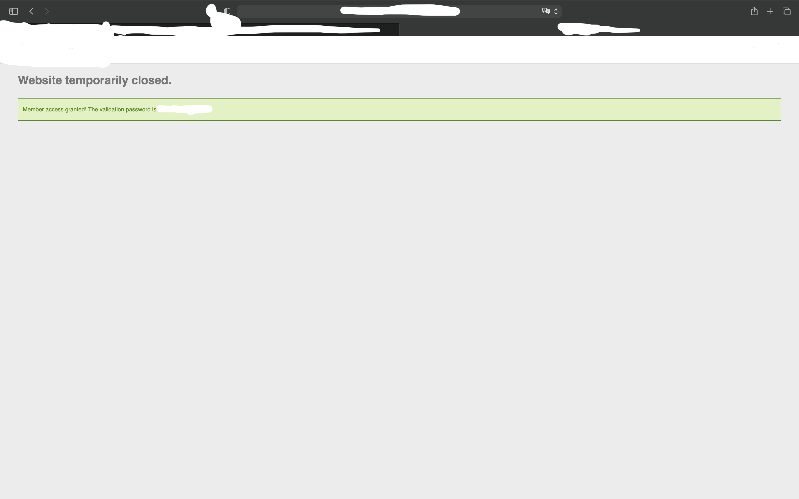

# HTML - Desactivated buttons

At the beginning of this challenge, we are on a webpage with a simple form.

With the title of the challenge, we already have an idea of what we are supposed to do.

First step, we are going to look at the code.

We can observe that there is a tag 'disabled' on two fields. So, with a right click on the code, we modify the HTML code in order to erase these fields. Once that is done, we can see that the 'Member access' button  and the text field are now available. We can write everything in the field, click on the button and that's it !

