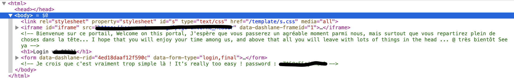

# HTML - Source Code

At the beginning of this challenge, we are on a webpage with a simple form.

With the title of the challenge, we already have an idea of what we are supposed to do.

First step, we are going to look at the code.

We can observe that there some comments in the HTML source code of the webpage. If we developed all the div, we can find the password.
