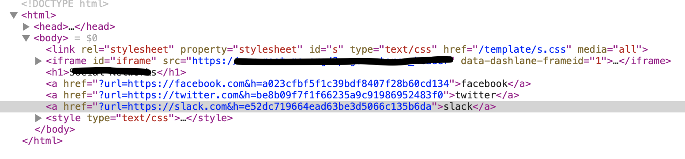
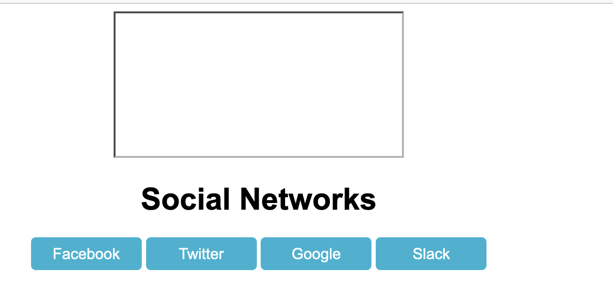
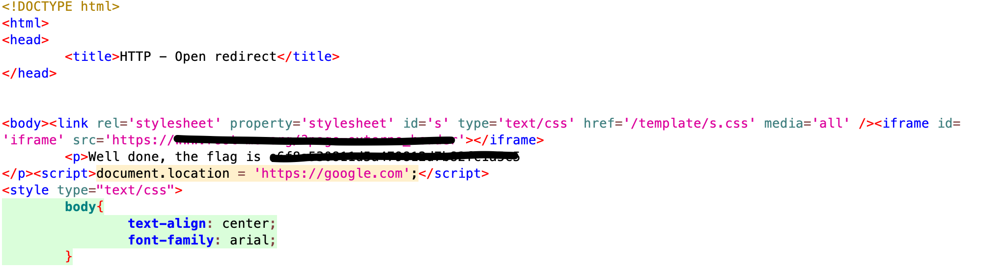

# HTTP - Open Redirect

The goal of this challenge is to find an other way to redirect to another subdomain clicking on a button.

On the first webpage, we can see 3 buttons and when clicking on one, we are redirecting on the website associated.

Looking at the source code, we can see that the button redirects us on a URL associated with something beginning by "h":

Copying this string and pasting it on Internet, we can see that it is a MD5 hash.

So, we deduce that what we have to enter is the URL + the hash associated with this URL.

For example, we are going to use `https://google.com`. The MD5 hash of this is `99999ebcfdb78df077ad2727fd00969f`.

As we are on Web-Server challenge, always use ZAP or others tools to intercept every request / response during the dialogue with the server.

So, on ZAP, when we arrive on the webpage with the buttons, we add an HTML line to add another button redirecting to google:
`<a href="?url=https://google.com&h=99999ebcfdb78df077ad2727fd00969f">Google</a>`

After adding that, we see that the button is added on the webpage:

Always intercepting the traffic, we click on the Google button created and finally, we are on a webpage with the password !

