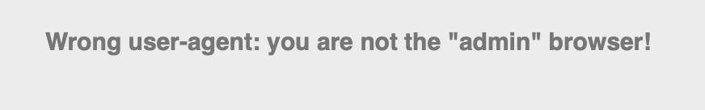
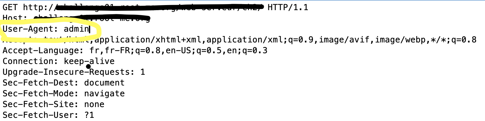
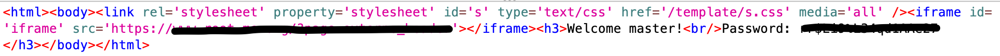

# HTTP - User Agent

When we begin this challenge, we arrive on a webpage that indicates us that we are not the admin of the browser:

With the title of the challenge, we know that we have to modify the user-agent during the first request to the server.

For that, using ZAP, in the HTTP header, we replace the present user-agent by the admin agent like this:

We send the request and in response, we have the flag:

