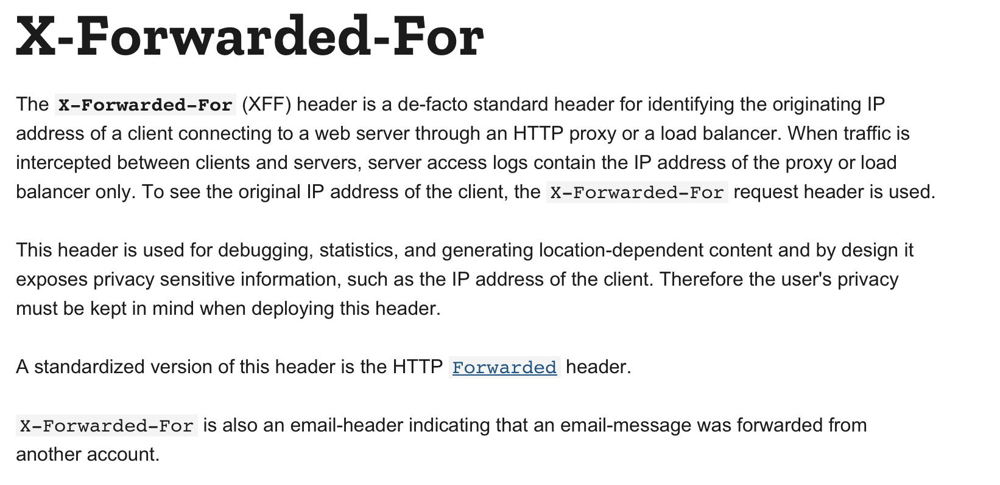
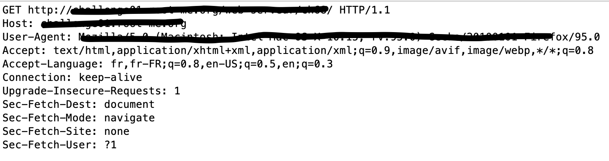
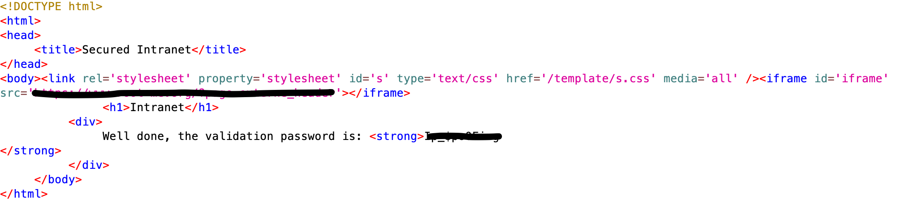

# IP Filtering

At the beginning of this challenge, we are informed that we don't have to authenticate us if we are connected on the LAN.

When we open the challenge, the webpage indicates to us that we are not on the LAN with our public IP.

No matter what we try to enter in the form, it is our public address that is transmitted to the server, so this indicates to the server that we are not on the LAN.

So, what we have to do is to try to modify the IP address before the request arrives to the server.

After some research on the web, we find that we have to modify / precise the `X-Forwarded-For` header and writes an private IP address



To do that, we can use "ZAP Proxy tool". We process to intercept the request before it is sent to the server. This is the request:



What we have to do is just to add this line:
```shell
X-Forwarded-For: 192.168.1.2
```

And that's it, we send the request. The server responds to us with the password !


